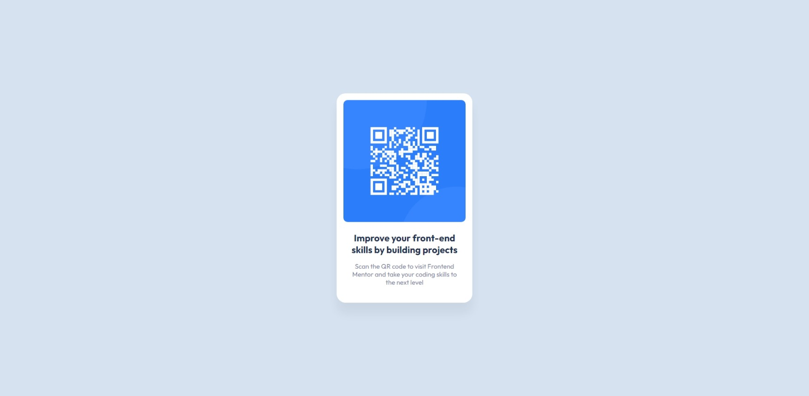

# Frontend Mentor - QR code component solution

This is a solution to the [QR code component challenge on Frontend Mentor](https://www.frontendmentor.io/challenges/qr-code-component-iux_sIO_H). 

## Table of contents

- [Overview](#overview)
  - [Screenshot](#screenshot)
  - [Links](#links)
- [My process](#my-process)
  - [Built with](#built-with)
  - [What I learned](#what-i-learned)
  - [Continued development](#continued-development)
  - [Useful resources](#useful-resources)
- [Author](#author)

## Overview

### Screenshot



### Links

- Solution URL: [Solution URL](https://github.com/Andrej2003/qr-code-component-main)
- Live Site URL: [Live site URL](https://andrej2003.github.io/qr-code-component-main/)

## My process

### Built with

- Semantic HTML5 markup
- CSS custom properties
- Flexbox
- Mobile-first workflow

### What I learned

I learned that using the rem unit really eases the process of making responsive pages and unwise use of percentages when specifying the width can mess up the page. In such a case we should use fixed measurements.

### Continued development

I would like get more comfortable with using position.

### Useful resources

- [Stack Overflow](https://stackoverflow.com/questions/3250790/making-a-div-that-covers-the-entire-page) - I got the idea to use ```position: absolute;``` from here.

## Author
- Frontend Mentor - [@Andrej2003](https://www.frontendmentor.io/profile/Andrej2003)
- GitHub - [@Andrej2003](https://www.github.com/Andrej2003)
